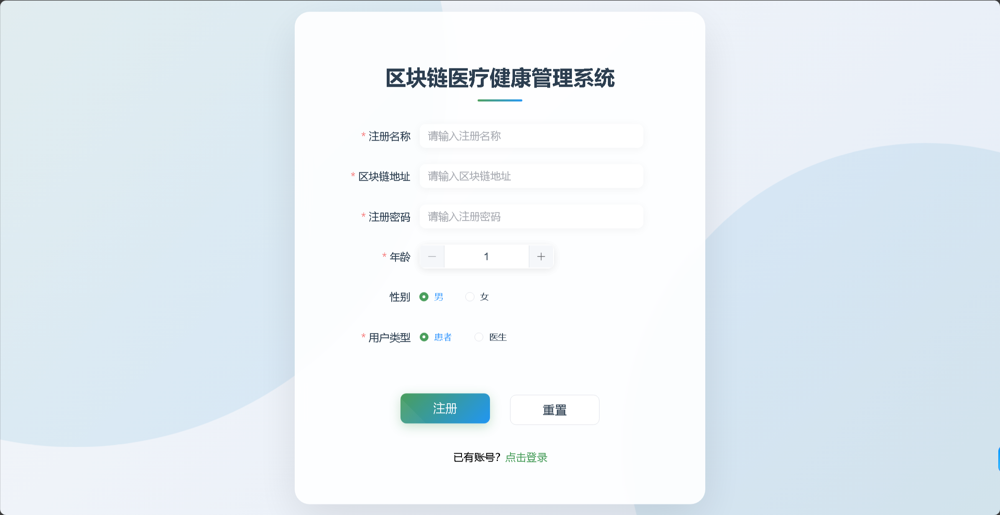
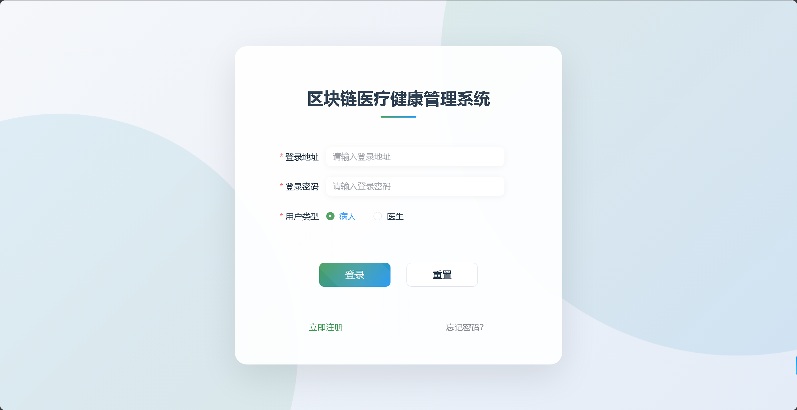
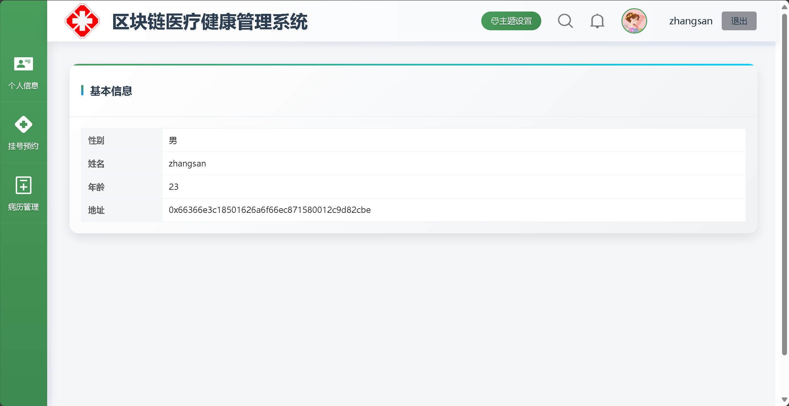
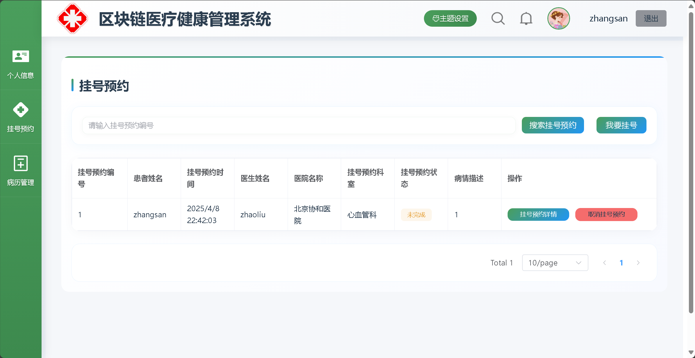
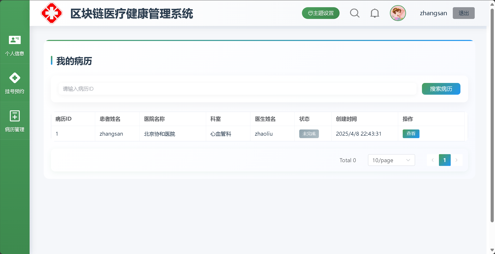
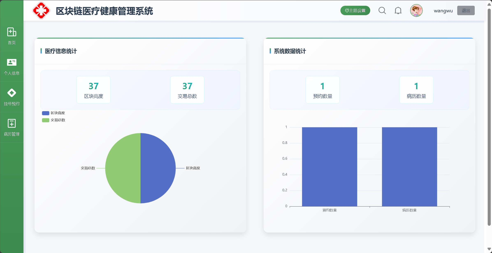
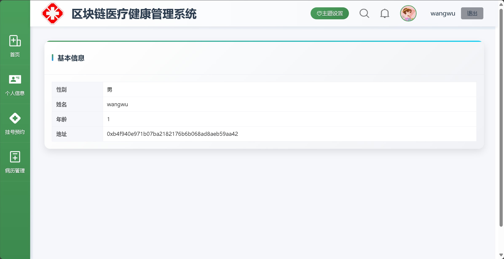
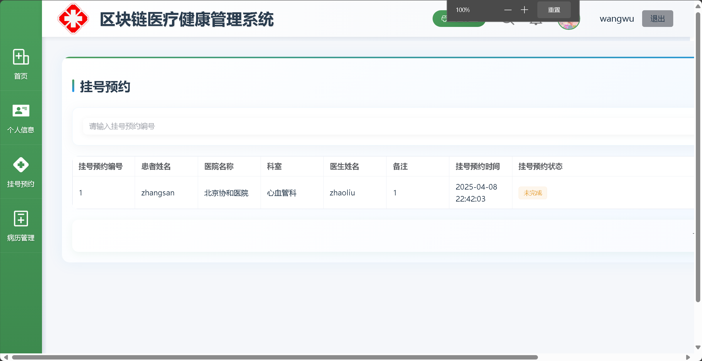
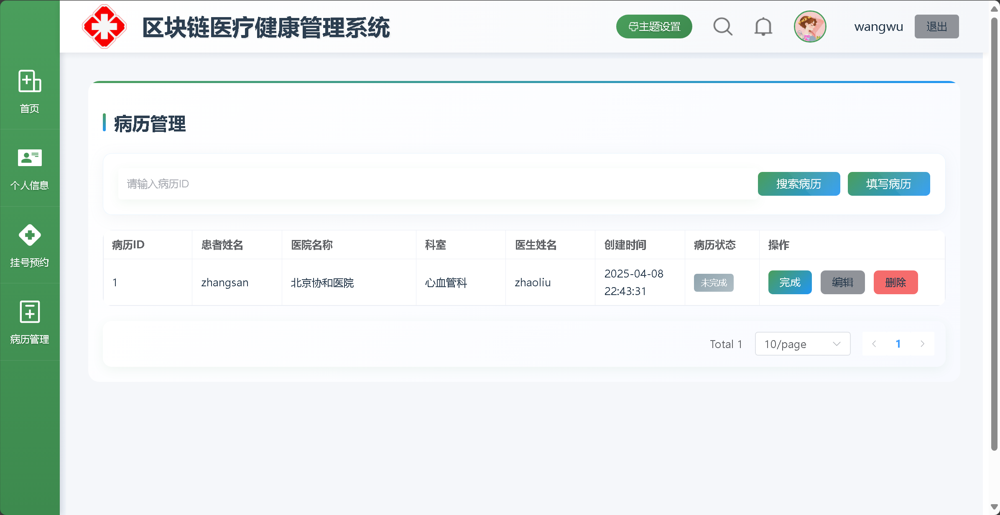

# **若依区块链医疗健康管理系统**  
**基于SpringBoot + Vue3 + FISCO-BCOS的若依区块链医疗健康管理系统**  

**在线访问地址**：http://175.178.241.129/ 

**测试账号**：

- **医生端**：

  ​	登录地址:0xb4f940e971b07ba2182176b6b068ad8aeb59aa42

  ​	密码:Abcd1234

- **患者端**：

  ​	登录地址:0x66366e3c18501626a6f66ec871580012c9d82cbe 

  ​	密码:Abcd1234

## 🌟 项目简介  
本项目是基于**若依（RuoYi）框架**深度开发的医疗健康管理系统，通过**FISCO-BCOS联盟链**实现医疗数据的安全存证与可信共享。系统主要功能包括：

- 👨⚕️ **医生端**：电子病历区块链存证、患者管理、预约审核
- 🏥 **患者端**：在线挂号、病历查询、区块链验证
- 🔗 **区块链层**：采用Solidity智能合约实现数据不可篡改

**核心价值**： 

✅ 医疗数据全程可追溯  ✅ 若依RBAC权限系统与区块链数字签名结合

---

## 🛠️ 技术架构

### 核心组件

| **模块**     | **技术栈**                                |
| ------------ | ----------------------------------------- |
| **前端框架** | Vue3 + Element Plus + Vite                |
| **后端框架** | Spring Boot 2.7 + 若依RBAC模块            |
| **区块链**   | FISCO-BCOS 3.2 + Solidity智能合约         |
| **数据库**   | MySQL 8.0（业务数据） + Redis（缓存优化） |

## 📋 系统功能  

### 医生端功能  
| 功能模块     | 说明                      |
| ------------ | ------------------------- |
| 首页         | 显示当日预约/患者人数统计 |
| 个人信息     | 医生信息                  |
| 挂号预约     | 审批患者预约申请          |
| 电子病历管理 | 创建病历并生成区块链存证  |

### 患者端功能  
| 功能模块 | 说明                     |
| -------- | ------------------------ |
| 个人信息 | 患者信息                 |
| 挂号预约 | 患者挂号预约申请         |
| 我的病历 | 查看区块链存证的加密病历 |

### 公共功能  
| 功能模块 | 说明              |
| -------- | ----------------- |
| 注册     | 注册患者/医生信息 |
| 登录     | 登录患者/医生端   |

---

## 📦 安装指南  

### 环境要求  
- JDK 1.8+  
- Node.js 18+  
- MySQL 8.0+  Redis
- FISCO-BCOS节点（[搭建指南](https://fisco-bcos-documentation.readthedocs.io/)）  

### 后端部署  
```bash
cd HRIP_Backend_match
mvn clean install
```

### **前端部署**

```
cd Medical
npm install
npm run dev [运行前端项目]
npm run build [打包前端项目]
```

## 📸 **界面展示**

### 🔐 公共页面

#### 1.注册界面



#### 2.登录界面



### 👨💻 患者端界面

#### 1.个人信息



#### 2. 挂号预约

*状态标识说明：*

| 状态图标 | 含义       | 操作权限 |
| -------- | ---------- | -------- |
| 🟢        | 预约成功   | 可取消   |
| 🟡        | 待医生确认 | 不可操作 |



#### 3.病历管理

*交互流程：*

- 通过时间轴展示病历创建过程
- 查看区块链存证状态实时显示（图标：✅ 已填写 / ⏳ 待确认）
- 支持病历摘要快速检索



### 👨⚕️ 医生端界面

#### 1.首页



#### 2.个人信息



#### 3. 挂号预约

*交互流程：*

1. 筛选待处理预约申请
2. 查看患者历史就诊记录
3. 通过数字签名确认审批【暂未实现】



#### 5. 病历管理

*交互流程：*

- 通过时间轴展示病历创建过程
- 查看区块链存证状态实时显示（图标：✅ 已填写 / ⏳ 待确认）
- 支持病历摘要快速检索



## 💻 维护者

- [zhengcookie] - 系统开发工程师（[[z2132085753@outlook.com](mailto:z2132085753@outlook.com)]）

## 版本历史

- 1.0.0 (2023-08-20)
  - 实现核心医疗存证功能
  - 完成医患双端基础功能模块
  - 集成FISCO-BCOS存证SDK


## 致谢

- FISCO-BCOS开源社区提供区块链技术支持
- 若依开源社区提供基础框架支持
